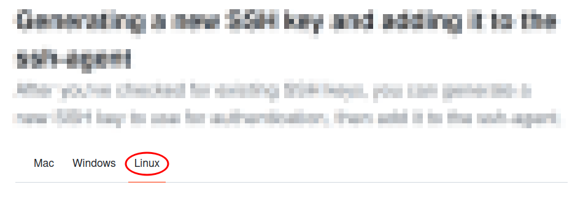
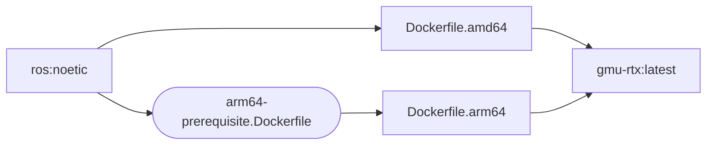

# gmu-rtx


---

[](https://github.com/gmu-rtx-ground/gmu-rtx/actions/workflows/docker-image-ci.yml)

## Controlling the robot

1. [Controlling the robot](/docs/controlling_robot.md)

## ROS

Coming soon

## Dependencies

### Jetson Xavier NX

The GMU-RTX ground team will be leveraging ROS on a host [NVIDIA Jetson Xavier NX](https://www.nvidia.com/en-us/autonomous-machines/embedded-systems/jetson-xavier-series/)

#### Jetson Xavier NX Pinout

**Section 4.4 Pin List** in the [datasheet](docs/nvidia/Jetson-Xavier-NX-Series-Modules-DS-10184-001_v1.9.pdf) provides pinout documentation for the Xavier NX. Alternatively, Jetsonhacks.com provides a useful [Xavier NX Pinout](https://jetsonhacks.com/nvidia-jetson-xavier-nx-gpio-header-pinout/) online.

#### udev rules

Custom `udev` rules are in use to bind the sensor modules to specified names and configurations. These rules are found in the [ROS/udev_rules](/ROS/udev_rules) directory.

| Module | Rules |
| --- | --- |
| Arduino |  |
| ublox GPS |  |
| wit-motion IMU |  |
| xBee 538 |  |

Ensure the `udev` rules are in added to the `/etc/udev/rules.d` directory and reboot the Jetson for the changes to take effet.

```sh
$ sudo mv /path/to/rules /etc/udev/rules.d
$ sudo reboot
```

### Windows Subsystem Linux (WSL)

[wsl](https://learn.microsoft.com/en-us/windows/wsl/install) will be used to help emulate the target Jetson Xavier Linux system. It will be a core prequisit for Windows users for this project. **Strongly recommend** completing this step before installing any other dependency. `wsl` will help ensure `git` and `Docker` run efficiently on a Windows development environment.

After enabling `wsl`, recommend downloading an Ubuntu image from the Microsoft Store app. There are multiple options available:

- [Ubuntu](https://apps.microsoft.com/detail/9pdxgncfsczv?hl=en-US&gl=US) | Latest stable image
- [Ubuntu (Preview)](https://apps.microsoft.com/detail/9p7bdvkvnxz6?hl=en-us&gl=US) | Latest available image
- `Ubuntu ##.##.# LTS` | Long term support versions by release YY.MM 

The [latest stable image](https://apps.microsoft.com/detail/9pdxgncfsczv?hl=en-US&gl=US) is usually the best option for most users.

*As a note, Jetson Xavier base image is based on `Ubuntu 20.04`.*

### Microsoft Visual Studo Code (VS Code)

Recommended editor for the project is [VS Code](https://code.visualstudio.com/). VS Code is relatively lightweight and offers useful extensions to streamline some of the development processes.The project will leverage [Dev Containers](https://marketplace.visualstudio.com/items?itemName=ms-vscode-remote.remote-containers) to help manage the Docker experience.

Suggested Extensions:

- [Dev Containers](https://marketplace.visualstudio.com/items?itemName=ms-vscode-remote.remote-containers)*
- [Remote Development](https://marketplace.visualstudio.com/items?itemName=ms-vscode-remote.vscode-remote-extensionpack)
- [Docker](https://marketplace.visualstudio.com/items?itemName=ms-azuretools.vscode-docker)

**Required*

#### .devcontainer

Inside the .devcontainer directory, there are several files that are used to configure the development environment:

- [devcontainer.json](.devcontainer/devcontainer.json) manages the Docker image and container configuration.
- [entrypoint.sh](.devcontainer/entrypoint.sh) add runArgs for connected usb devices (IMU, GPS, etc.).
- [detect-usb.sh](.devcontainer/detect-usb.sh) sets proper permissions for those connected usb devices.

> [!NOTE]
> The two scripts are mainly for the wsl environment to properly pass the device through windows to wsl and then give it the correct name and permissions.


### Github.com Account

The project is leveraging github.com to manage the code repository as well as other tooling such as Docker images and ROS package customization.

A github.com account will be required to access the main repository [gmu-rtx-ground/gmu-rtx](https://github.com/gmu-rtx-ground/gmu-rtx). In addition, team members will need to be added to the `gmu-rtx-ground-team`.

#### SSH Keys

The project repos will be private prior to the competition. Private repos require SSH to syncronize between the github.com repo and the host developer copy of the [gmu-rtx-ground/gmu-rtx](https://github.com/gmu-rtx-ground/gmu-rtx) repo. SSH will also be a requisit to download the latest Docker image.

Users will need to pair [ssh keys](https://docs.github.com/en/authentication/connecting-to-github-with-ssh) with their github.com account. For Windows users, it is recommended to follow these steps within the `wsl` context; i.e. follow the Linux steps rather than Windows when given the option.



### Docker

Docker will be leveraged to create a deterministic testing environment for the team. The required dependencies, libraries, and packages to run ROS and the selected hardware modules will be managed in the repo's [Dockerfile](.devcontainer/Dockerfile).

There are multiple paths to using Docker depending on the development environment. For Windows users, it is recommended to use [Docker Desktop](https://docs.docker.com/desktop/setup/install/windows-install/). For Linux users, [Docker Engine](https://docs.docker.com/engine/) is likely sufficent.

> [!TIP]
> For most Windows users, `Docker Desktop for Windows - x86_64` will be the correct version. It is **strongly recommended** to follow the installation instructions for `WSL 2 backend, x86_64`.

#### Github Container Registry

The project leverages [Github Container registry](https://docs.github.com/en/packages/working-with-a-github-packages-registry/working-with-the-container-registry) to manage the development Docker image. The team's [personal access token (PAT)](https://docs.github.com/en/authentication/keeping-your-account-and-data-secure/managing-your-personal-access-tokens) is required to establish a secure connection between the registry and the development environment.

> [!IMPORTANT]
> [@cnlee1702](https://github.com/cnlee1702) will provide project PAT as needed

Github recommends storing the PAT as an [environment variable](https://www.geeksforgeeks.org/environment-variables-in-linux-unix/):

```bash
$ export GITHUB_PAT=<token>
```

The container registry will require authentication:

```bash
$ echo $GITHUB_PAT | docker login ghcr.io -u <USERNAME> --password-stdin
> Login Succeeded
```

After authentication, users can pull the latest Docker image via:

```bash
$ docker pull ghcr.io/gmu-rtx-ground/gmu-rtx
```

#### gmu-rtx Image Lineage

The project [gmu-rtx package](https://github.com/orgs/gmu-rtx-ground/packages/container/package/gmu-rtx) uses the official [ros:noetic](https://hub.docker.com/_/ros/) public Docker hub image as a base image. The project uses a Docker [multi-platform build](https://docs.docker.com/build/building/multi-platform/) to target both `linux/amd64` and `linux/arm64` platforms simultaneously. The `linux/amd64` image provides the team with a deterministic environment to build and test software components. The `linux/arm64` image provides assurance the team's solutions will function on the target `Jetson Xavier NX` platform. 

> [!IMPORTANT]
> Although the image is compatible with the target system, the intention is to leverage build scripts on the target platform rather than directly running the ground vehicle from within a Docker container.



The [arm64-prerequisite](docker/arm64-prerequisite.Dockerfile) image precompiles dependency libraries that are not available via `apt` for `arm64` platforms. This image is scheduled to build nightly at 12:00am UTC to keep CI/CD runtimes managable.

